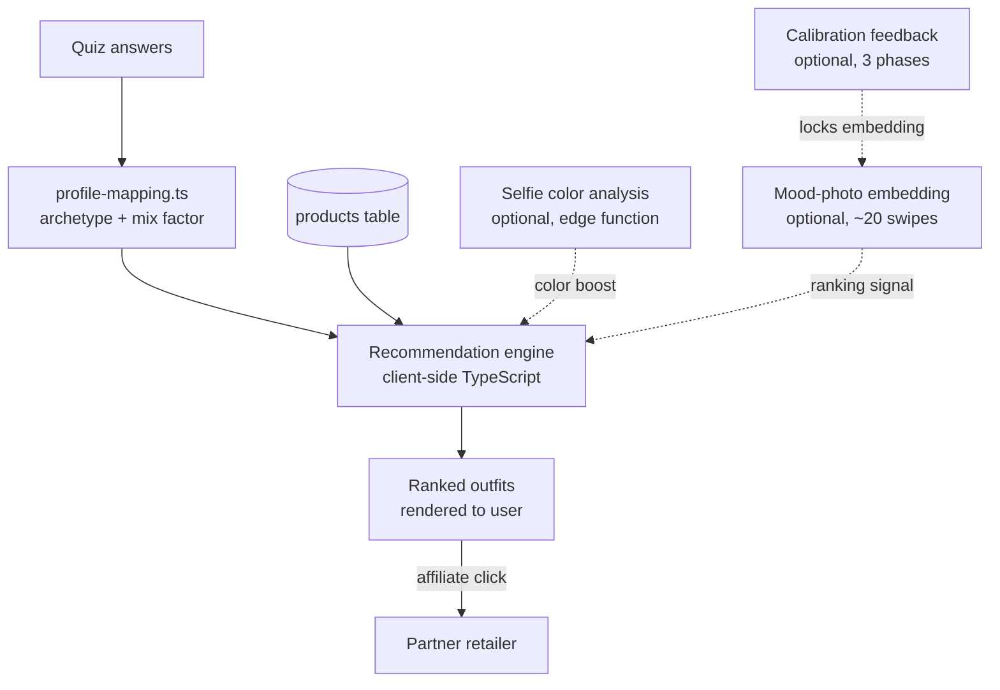

# Architecture

FitFi is a client-rendered recommendation web app with a Supabase backend. The recommendation engine runs in the browser over a product catalog and a per-user style profile that are hydrated from Postgres. Edge functions handle media analysis, payments, and feed imports, but the act of "given a user, return outfits" is a synchronous function call inside React, with no network roundtrip during ranking.

The engine is a linear pipeline of typed helper modules invoked from one entry point (`src/engine/recommendationEngine.ts`). There is no agent orchestration framework. The modular layout makes it cheap to insert new signals (mood-photo embeddings, color-season analysis, calibration feedback) without rewriting the ranker.

## End-to-end flow

1. The user completes a three-step quiz: gender, fit and print preferences, budget (`src/data/quizSteps.ts`).
2. Answers are written to `localStorage` (key `ff_quiz_answers`) and to the `quiz_answers` table in Supabase.
3. Profile mapping (`src/engine/profile-mapping.ts`) converts the style selections into a normalized score vector across five archetypes (casual, formal, sporty, vintage, minimalist), applies occasion-based boosts (for example "work" boosts the formal score), and produces a dominant archetype, a secondary archetype, and a mix factor.
4. The product catalog is fetched from the `products` table, filtered by gender and `in_stock = true`.
5. The recommendation engine runs entirely client-side:
   1. Hard filters by budget, gender, and available sizes.
   2. Reclassifies products into outfit slots: tops, bottoms, shoes, dresses.
   3. If the user has a stored selfie color analysis, a photo-enhancement pass boosts color-compatible items.
   4. Assembles outfit candidates by combining the dominant and secondary archetypes weighted by the mix factor.
   5. Ranks outfits using archetype match, seasonal fit, material preferences, and the user's mood-photo embedding when available.
   6. A diversity filter prevents near-duplicate outfits that share occasion and archetype.
6. Top N outfits are rendered. Affiliate links open via a tracking wrapper.

## Signals that feed the ranker

1. **Quiz-derived archetype.** Dominant and secondary scores from `profile-mapping.ts`. Always present.
2. **Color-season profile.** Optional. Produced by the `analyze-selfie-color` edge function using OpenAI vision when a user uploads a selfie. Persisted to Postgres and read back as a boost on color-compatible items.
3. **Mood-photo swipes.** Optional. About 20 swipes through curated images in `mood_photos`. Each swipe lands in `style_swipes`. A Postgres RPC `compute_final_embedding` aggregates the pattern into an archetype vector, stored in `style_profiles.visual_preference_embedding` (JSONB).
4. **Calibration feedback.** Optional three-phase loop (questions → swipes → adaptive outfit feedback) in `src/services/calibration/adaptiveOutfitGenerator.ts`. The embedding is locked once enough generated outfits have been confirmed.

The ranker combines these into a single score per outfit. There is no separate model file: weights are inline coefficients in TypeScript, tunable by editing constants.

## What runs where

| Concern | Lives in |
|---|---|
| Quiz state and answers | React, `localStorage`, `quiz_answers` (Supabase) |
| Product catalog | `products` table (Supabase) |
| Recommendation ranking | Client (browser, TypeScript) |
| Selfie color analysis | Edge function `analyze-selfie-color` (OpenAI vision) |
| Mood-photo tagging | Edge function `ai-mood-tags` |
| Visual preference embedding | Postgres RPC `compute_final_embedding`, stored in `style_profiles.visual_preference_embedding` |
| Calibration feedback loop | Client (`src/services/calibration/adaptiveOutfitGenerator.ts`) |
| Payments | Stripe via `create-checkout-session`, `create-portal-session`, `stripe-webhook` |
| Affiliate feed ingest | Edge function `import-daisycon-feed` |

The recommendation engine does not call any LLM at ranking time. LLMs are used out-of-band for selfie color analysis and mood-tag generation; their outputs persist to Postgres and the ranker reads pre-computed signals.

## On "Truth Ledger"

A search for `truth_ledger`, `TruthLedger`, or "truth ledger" returns no results in this repository. There is no construct by that name.

The closest analogue is the `EmbeddingSnapshot` pattern in `src/services/visualPreferences/embeddingService.ts`. Each snapshot records the user's archetype vector, attribution of each contributing source (quiz weight, swipes weight, calibration weight), and the trigger event (`quiz_complete`, `swipes_complete`, `calibration_complete`, `manual_update`). This produces a time-ordered history of how a profile evolves, but it is not framed as a ledger of "truth."

## Key Supabase tables

| Table | Role |
|---|---|
| `products` | Product catalog. Every outfit is composed from rows here. |
| `quiz_answers` | Raw quiz responses, written on submit. |
| `style_preferences` | Normalized archetype scores after the quiz. |
| `style_swipes` | One row per mood-photo swipe, used to build the visual embedding. |
| `mood_photos` | Curated outfit images for swipe-based learning, with archetype weights and color palettes. |
| `style_profiles` | The user's locked-in profile: archetype vector, embedding, calibration state. |
| `photo_analyses` | Results from outfit-photo and selfie analysis edge functions. |

Full schema lives in `supabase/migrations/`.

## Trade-offs

- **Client-side ranking.** Latency-free once products are hydrated and easy to iterate on, but bounded by browser memory and shipped JS size. Acceptable here because the catalog is small.
- **Pre-computed signals over live LLM calls.** Cheaper and faster than calling an LLM in the request path. The cost is that signal quality is fixed at compute time, not query time.
- **One synchronous pipeline.** Easy to debug, test, and trace. The trade-off is that the architecture would need a deliberate refactor if future work required concurrent specialized agents (for example, color, fit, and occasion agents producing independent rankings to combine).

## What this is not

- Not multi-agent in the LangGraph, LangChain, or CrewAI sense. There is no agent loop and no tool-calling at ranking time.
- Not a server-side recommender. The ranker lives in the React bundle.
- Not blockchain-backed, federated, or quantum-anything. Earlier README versions claimed these; they are not in the code and never were.
